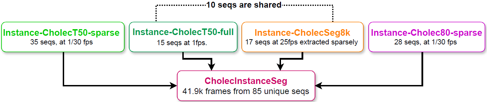
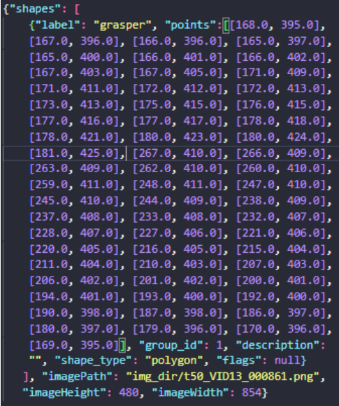
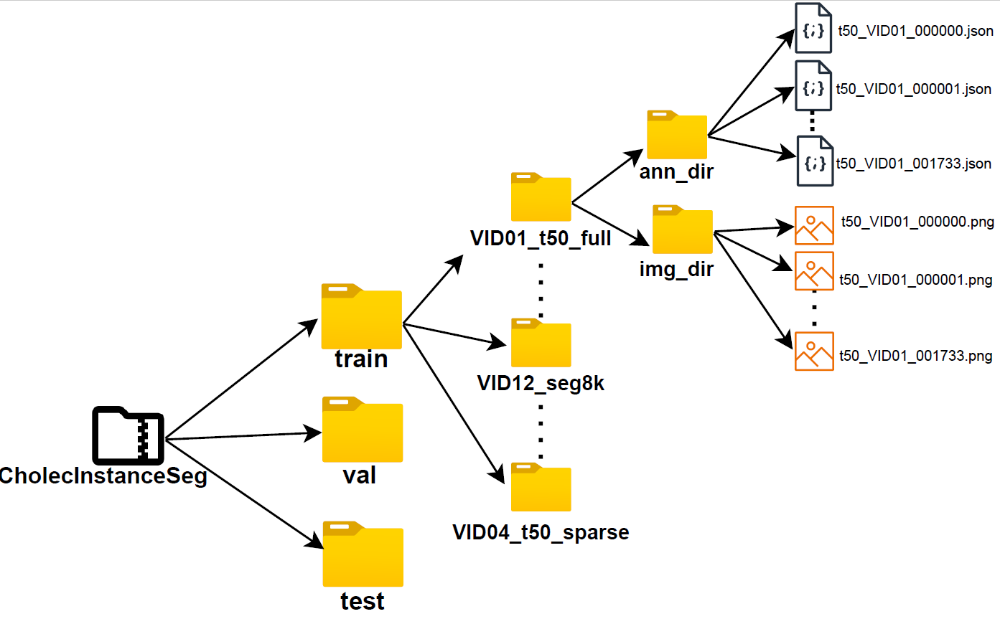
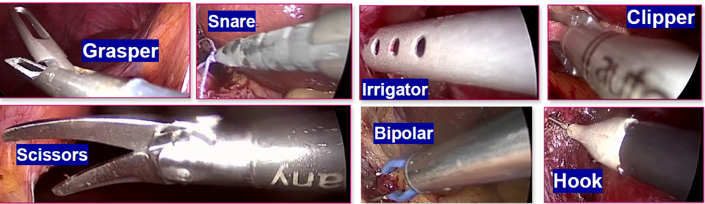

# CholecInstanceSeg: A Tool Instance Segmentation Dataset for Laparoscopic Surgery

## Introduction
In laparoscopic and robotic surgery, precise tool instance segmentation is an essential technology for advanced computer-assisted interventions. Although publicly available procedures of routine surgeries exist, they often lack comprehensive annotations for tool instance segmentation. Additionally, the majority of standard datasets for tool segmentation are derived from porcine(pig) surgeries. To address this gap, we introduce CholecInstanceSeg, the largest open-access tool instance segmentation dataset to date.
Derived from the existing CholecT50 and Cholec80 datasets, CholecInstanceSeg provides novel annotations for laparoscopic cholecystectomy procedures in patients. Our dataset comprises 41.9k annotated frames extracted from 85 clinical procedures and 64.4k tool instances, each labelled with semantic masks and instance IDs. To ensure the reliability of our annotations, we perform extensive quality control, conduct label agreement statistics, and benchmark the segmentation results with various instance segmentation baselines. CholecInstanceSeg aims to advance the field by offering a comprehensive and high-quality open-access dataset for the development and evaluation of tool instance segmentation algorithms.

---

## CholecInstanceSeg Dataset

The **CholecInstanceSeg** dataset is publicly available for download:  
🔗 [Download CholecInstanceSeg](https://www.synapse.org/Synapse:syn60239970/wiki/628710)  

### Corresponding Images  
The original images corresponding to the annotations in this dataset can be obtained from their respective sources:  

- Cholec80 & CholecT50: Follow the instructions on the University of Strasbourg’s CAMMA research group website:  
  🔗 [http://camma.u-strasbg.fr/datasets](http://camma.u-strasbg.fr/datasets)  
- CholecSeg8k: Available for download on Kaggle:  
  🔗 [Kaggle Dataset](https://www.kaggle.com/datasets/newslab/cholecseg8k)  

### Simplified Access  
To make this process easier, we have compiled the required **CholecT50, Cholec80, and CholecSeg8k images** for which we provide annotations. These images can be accessed here:  
🔗 [Download Required Images](https://www.synapse.org/Synapse:syn64826192/wiki/630936)  
We have also provided a script to combine the annotations in CholecInstanceSeg with the corresponding images in this repository. Under utilities. 

---

## Dataset description
CholecInstanceSeg, which contains 41.9k frames from 85 unique image sequences, can be partitioned into four distinct sections based on the data source: Instance-CholecSeg8k, Instance-CholecT50-full, Instance-CholecT50-sparse, and Instance-Cholec80
sparse.
1.  Instance-CholecSeg8k: For the 8,080 frames over 17 sequences provided in CholecSeg8k, we utilized all the images in this dataset.
2. Instance-CholecT50-full: For 15 sequences within CholecT50(CholecT50-full), we utilized all frames provided by CholecT50.
3. Instance-CholecT50-sparse: For the remaining 35 sequences in CholecT50(CholecT50-sparse), we sampled these sequences by selecting one frame out of every 30 frames ( 1/30 fps), ensuring a minimum of 50 frames in each sequence.
4. Instance-Cholec80-sparse: We extracted 28 videos from Cholec80, which are not included in CholecT50 and CholecSeg8k, and sampled these videos at 1/30 fps, ensuring a minimum of 50 frames in each sequence.

 
 


---


## Sample JSON annotation file and folder structure.
 
  

---

## Tools
There are seven tool categories annotated in CholecInstanceSeg. Grasper, Bipolar, Hook, Clipper, Scissors, Irrigator, Snare. 



---

## Utils
This repository contains various utility functions and notebooks showing their use, including:

1. Conversion of Labels: Convert labels from instance maps and polygons to segmentation maps. 
2. Label Visualization: Visualize labels as images or videos. 
3. Format Conversion: Convert annotations from the LabelMe format to the COCO format for training and evaluation.
4. Combining annotations with corresponding images: We provide a util to combine annotations in cholecinstanceseg with the corresponding images which we have downloaded

[learn more](./utilities/)

---

## Citing CholecInstanceSeg. 
If you use the annotations provided by our dataset, please include the BibTex citation for the [dataset paper](https://arxiv.org/pdf/2406.16039)  .

---

```bibtex
@article{alabi2024cholecinstanceseg,
  title={CholecInstanceSeg: A Tool Instance Segmentation Dataset for Laparoscopic Surgery},
  author={Alabi, Oluwatosin and Toe, Ko Ko Zayar and Zhou, Zijian and Budd, Charlie and Raison, Nicholas and Shi, Miaojing and Vercauteren, Tom},
  journal={arXiv preprint arXiv:2406.16039},
  year={2024}
}
```
